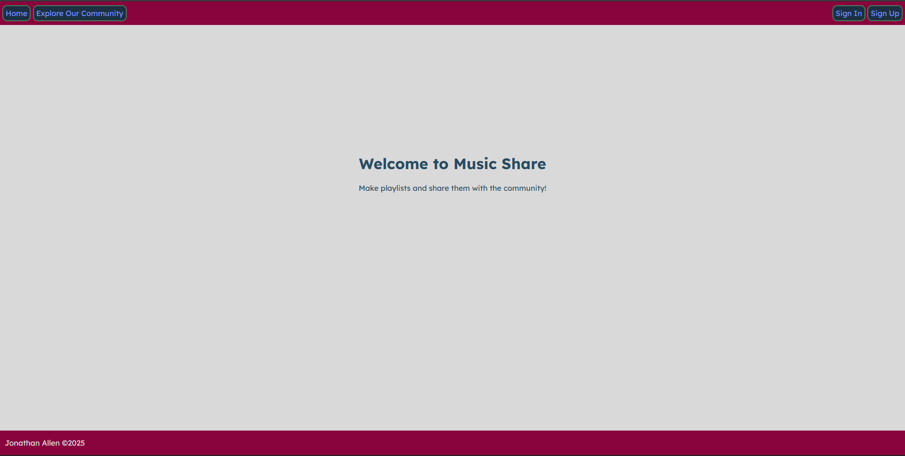

# Music Share

Check out the app [here](https://music-playlist-share-71fd7ec0314e.herokuapp.com/).  
[Planning Materials](https://trello.com/b/XGdJ3INt/music-app)

## Description

This app is for creating and sharing your favorite music playlists. Users can sign in to create, edit, and remove playlists and songs. Anyone can view all the playlists our community has made on our community page.

## Background

This app was built as part of my General Assembly course for our Unit 2 project. It showcases full **CRUD** functionality and utilizes the 7 **RESTful** routes to create, read, update and delete playlists and songs. It also uses authentication to prevent other people from modifying or deleting your playlists and songs. This app uses the *Model*, *View* and *Controller* (MVC) design as a clean way to organize the code and files.

## Technologies Used

- HTML
- CSS
- JavaScript
- EJS
- Express
- Express Session
- MongoDB
- Node.js
- Dotenv
- Morgan
- Method Override
- Bcrypt
- [Coolors.co](https://coolors.co/)
- [Trello](https://trello.com/)
- [Lucid](https://lucid.co/)
- [Wireframe.cc](https://wireframe.cc/)

## Future Updates

- Add a user favorites page. So users can see all the playlists they have favoited.
- Add a music API so you can make actual playable playlists.